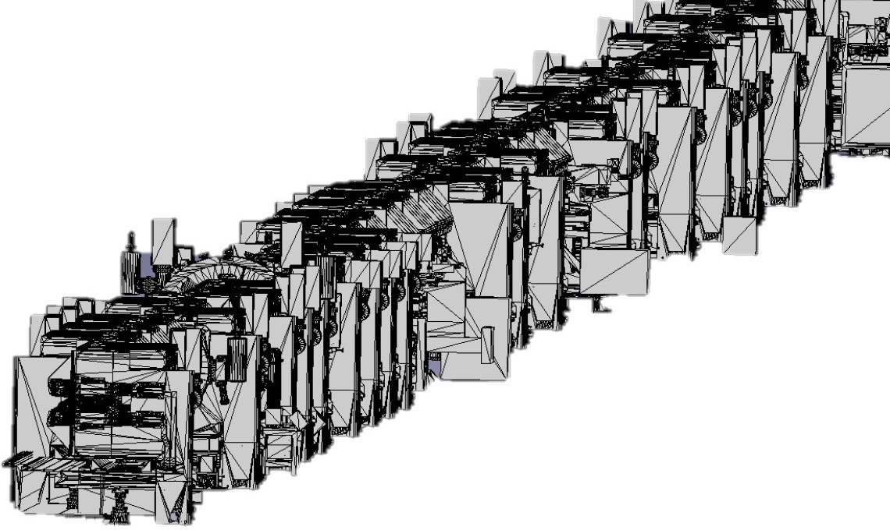
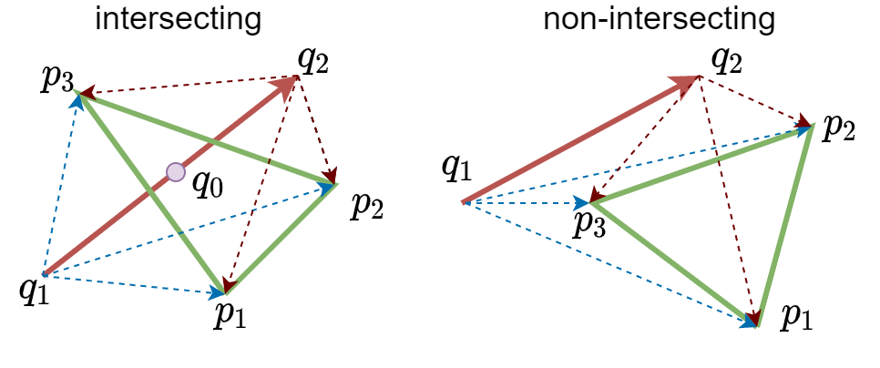

::: titlepage
{height="3cm" width="3cm"}
{height="3cm" width="9cm"}

**Longitudinal Space Charge Modeling in the CERN PS**

Alexander J. Laut

A thesis presented for the degree\
*Master of Physics*

Department of Physics\
Plasmas, Lasers, Accelerators and Tokamaks\
Paris-Saclay University\

Orsay, France September 2021
:::

# Acknowledgements {#acknowledgements .unnumbered}

First, I'd like to thank my supervisor, Dr. Alexandre Lasheen, for
providing me this amazing opportunity to work at CERN and for being
extraordinarily accommodating throughout my technical studentship.
Logistically, he helped me navigate moving between countries and
continents during a particularly dynamic time in history. He was an
exquisite mentor, learning resource, and peer with whom I'm thankful for
having had the opportunity to work with. Additionally I'd like to thank
others within the SY-RF-BR section at CERN for their insight during
section meetings and other technical discussions.

I'd like to thank the professors at Université Paris-Saclay, Jean-Marcel
Rax, Guy Bonnaud and Sophie Kazamias, for encouraging me to pursue the
M2 GI (Grands-Instruments), subsequently named M2 PLATO (Plasmas,
Lasers, Accelerators and Tokamaks). This program was an amazing learning
experience as well as an opportunity to explore the various scientific
institutions located within France and Switzerland.

I would also like to thank my previous employer, Jagadishwar Sirigiri,
and others at Bridge12, for the immense knowledge and experience I
accumulated while working there for almost 4 years as a Scientist. Both
the hands-on and analytic experiences I developed there proved
instrumental towards my success as a master's student.

Lastly I'd like to thank my parents, Philip and Donna, and my sister
Gabrielle.Their all encompassing support, intrigue, and encouragement
with my endeavors as a young physicist/engineer has kept me motivated.

# Introduction

## CERN and the LHC

The European Organization for Nuclear Research, or CERN, is an
international institution tasked with providing particle accelerators to
scientists for purposes of conducting high energy physics experiments.
It is the home of the LHC (Large Hadron Collider) accelerator chain,
comprised primarily of LINAC4, the PS (Proton Synchrotron), the PSB
(Proton Synchrotron Booster), the SPS (Super Proton Synchrotron) and the
LHC itself, a particle accelerator with circumference of 27 kilometers
around. It is located across the Franco-Swiss border local to Lake
Geneva, the Jura mountains, and Mont Salève.

![The CERN Accelerator Complex includes various particle injectors such
as the PS and SPS, and large detection experiments such as ATLAS and CMS
[@forthomme_cern_2021].](figs/1024px-Cern-accelerator-complex.svg.png){#fig:cern}

The LHC collides energetic and intense proton bunches against one other
so that the resulting particles produced in these collisions can be
observed and analyzed. Upon analysis, these observations may provide
evidence for particle's predicted to exist according to the Standard
Model of particle physics, namely the Higgs Boson. These particle's may
vary in charge, spin, mass, momentum, etc. Often weakly interacting with
matter, so their qualities must be quantified through the use of large
particle detector systems. For example, the CMS (Compact Muon Solenoid)
experiment is comprised of solenoids to probe a particle's momentum from
perceived magnetic rigidity, calorimeters to estimate particle energy
deposition, and micro-channel plates to qualify time-of-flight and
generalized position tracking measurements, as depicted in
Figure [1.2](#fig:cms){reference-type="ref" reference="fig:cms"}.

![Particles generated by proton-proton collisions within the LHC Radial
pursue radial trajectories through the CMS detector
[@barney_cms_2016].](figs/CMSslice_whiteBackground.png){#fig:cms}

To verify the existence of the Higgs Boson, physicists must be able to
resolve the energy spectra corresponding to the various particles
produced in proton-proton collisions. To mitigate large experimental
uncertainty due to collision variance and the particle product
variability, the total number of interaction *events* must be increased.
This can be done by increasing the interaction luminosity along with
total acquisition time. We see in
[\[eq:luminosity\]](#eq:luminosity){reference-type="eqref"
reference="eq:luminosity"} how, for a bivariate gaussian beam, the
luminosity ($\mathcal{L}$) scales with number of bunches $n_B$,
particles per bunch $N$ and inversely with beam width $\sigma$ per

$$\mathcal{L} = \frac{n_b N^2f_{rep}}{4\pi\sigma_x\sigma_y}H_d
    \label{eq:luminosity}.$$

Because acquisition time is already a strong limitation, there is an
ever persistent effort to improve the beam luminosity, effectively
defined by the quality of the injectors. This is the motivation behind
the HL-LHC (High Luminosity LHC) initiative whose goal is to increase
beam luminosity by a factor of 10 [@aberle_high-luminosity_2020]. The
LIU (LHC Injectors Upgrade) project is directed to upgrading the
injectors to deliver the required additional beam brightness
[@damerau_lhc_2014].

## Space-Charge Limitations

As particle beam intensities are increased to improve luminosity, the
electromagnetic fields of charged particle bunches will self-interact.
This interaction, named *space-charge*, may cause the bunch to repel
apart, break up, or induce other instabilities and perturbations
yielding to overall transmission loss. In the transverse plane,
maintaining a tight beam size is accomplished through the use of strong
focusing optics and by reaching higher beam energies whereas in the
longitudinal plane, space-charge becomes critical during injection and
extraction where the efficiency of transferring bunches from one ring to
the next is highly dependent on how short the bunch length can be kept.
Instabilities that can lengthen the bunch length can therefore
negatively impact total beam brightness factored towards the LHC.

As will be discussed further in the text, a particle within a bunch will
experience a longitudinal *induced voltage*
$$\Delta V = \frac{-i}{\omega_s}\frac{Z}{n}\frac{d\lambda}{d\tau}$$
dependent on the *longitudinal space-charge impedance* given by
$$\frac{Z}{n} = -i\frac{Z_0}{\beta\gamma^2}g$$ which scales inversely
with $\beta \gamma^2$. Accordingly, induced voltage due to space-charge
is generally a low energy effect except at the highest bunch
intensities.

Small perturbations and density fluctuations in the bunch's longitudinal
charge density profile can create self amplifying wakefield fluctuations
that can lead to *micro-bunch instabilities*. As observed in
Figure [1.3](#fig:microbunch_instabilities){reference-type="ref"
reference="fig:microbunch_instabilities"}, a narrow bunch distribution
can spontaneously split due to local fluctuations in the bunch profile
that have a negative feedback mechanism for promoting further
instabilities.

{#fig:microbunch_instabilities}

## Particle Injectors

In the PS (Proton Synchrotron), the particle energy is accelerated from
2-26 GeV in 3.6 seconds
(Table [1.1](#tab:ps_parameters){reference-type="ref"
reference="tab:ps_parameters"}). Accordingly where space-charge is an
important consideration towards the beginning of its ramp, at
relativistic energies, the PS can neglect space-charge towards
extraction.

::: {#tab:ps_parameters}
  Parameter                        Symbol       Injection    Extraction
  ---------------------------- --------------- ------------ ------------
  Circumference (m)                   C            628      
  Kinetic Energy (GeV)                W            2.0          25.0
  Lorentz Factor                 $\gamma_s$        3.1          28.7
  Revolution Frequency (kHz)        $f_s$          452          476
  RF Harmonic                        $h$            9            21
  RF Frequency (MHz)              $f_{RF}$          4            10
  Transverse Tune                $Q_x, Q_y$     6.21, 6.24  
  Transition Factor              $\gamma_t$        6.1      
  Bunch Width (ns)              $\sigma_\tau$       26           1

  : Updated Injection/Extraction parameters for PS at "flat-top\" and
  "flat-bottom\" respectively after the injection energy was upgraded
  from 1.4 to 2 GeV
:::

As seen in Figure [1.4](#fig:ps_impedance){reference-type="ref"
reference="fig:ps_impedance"}, the space-charge impedance is nearly
compensated by the ring's effective inductive impedance near transition
energies at which point the synchronism between RF systems, magnetic
field ramp, and bunch phase, requires dynamic adjustment to maintain
longitudinal stability. Accordingly there is a lot of potential for
space-charge induced instabilities to degrade the bunch during ramp and
therefore is of particular interest for space-charge studies.

![Proton momentum (blue) compared with red (inductive impedance) during
PS Ramp
[@lasheen_alexandre_ps_2020].](figs/energy_v_space_charge_impedance.png){#fig:ps_impedance}

The luminosity of proton-proton collisions occurring within the LHC is
almost strictly defined by the beam intensity achieved from the injector
chain. At low energies and high intensities, as in LINAC4 and the PS,
space-charge effects are fighting to destabilize the beam, hence
motivation to raise the injection energy in the PS.

## RF Manipulations in the PS

Protons are injected into the PS from the four superimposed rings of the
PSB (Proton Synchrotron Booster) as depicted in
Figure [1.5](#fig:ps_complex){reference-type="ref"
reference="fig:ps_complex"}.

![The PS complex [@belleman_ps_2020], LINAC4 replacing LINAC2 (not
pictured) as the start of the LHC injector
chain.](figs/pscomplex.png){#fig:ps_complex}

At these lower energies, space-charge dominates and accordingly particle
energies must be increased before bunches can be merged. As observed in
Figure [1.6](#fig:bcms){reference-type="ref" reference="fig:bcms"}, the
PS conducts a series of *manipulations* where RF voltage profiles of
varying harmonics are used to position, accelerate, merge and then split
the bunches longitudinally according to the varying space-charge
limitations. This BCMS (batch compression matching and splitting)
process is visualized in Figure [1.6](#fig:bcms){reference-type="ref"
reference="fig:bcms"}.

{#fig:bcms}

These manipulations are accomplished by a complicated and dynamic RF
ramp scheme as depicted in
Figure [1.7](#fig:ps_ramp){reference-type="ref"
reference="fig:ps_ramp"}. This is accomplished through the use of
various RF cavities space throughout the PS ring.

{#fig:ps_ramp}

## Validation of Longitudinal Space-Charge Trackers

When current space-charge approximations are incorporated into
longitudinal tracking codes such as BLonD [@noauthor_cern_nodate], we
can observe that the bunch length oscillation amplitude and frequency
can only be matched when current space-charge calculations are reduced
by roughly 30%, as seen in
Figure [1.8](#fig:BlonD_v_experiment){reference-type="ref"
reference="fig:BlonD_v_experiment"}. This discrepancy suggests that
there may exist an additional stabilizing phenomena within which the
current model for longitudinal space-charge impedance is neglecting.

![Bunch length oscillation simulation (orange) benchmarked with
experiment (black)
[@lasheen_longitudinal_2021].](figs/simulation_v_experiment.png){#fig:BlonD_v_experiment}

A possible candidate to describe this discrepancy may be related to the
fact that current longitudinal codes neglect transverse betatron motion,
suggesting that the variance in individual transverse particle
trajectories may lead to describing new phenomena in the longitudinal
plane.

# Beam Dynamics

This chapter will briefly overview betatron motion in the transverse
plane followed by synchrotron motion in the longitudinal plane.
Furthermore, bunch wakefields and longitudinal space-charge impedance
will be presented to provide context for how particle bunches can
destabilize in longitudinal phase-space. The synchrotron frequency, a
parameter partially observable by experiment, will be described as will
the various ways in which space-charge can affect this quantity.

## Transverse Beam Dynamics

### Betatron Motion

A particle's transverse position $u(s)$ (referring to horizontal or
vertical transverse positions $x$ and $y$), and derivative
$u'(s)=du/ds$, equivalent to particle divergence within a focusing
lattice, is characterized by the beta function $\beta(s)$, particle
emittance $\epsilon$, and betatron phase $\phi$ so that
$$u_\beta(s)=\sqrt{\beta(s)\epsilon}\cos\phi \qquad u_\beta'(s)=-\sqrt{\frac{\epsilon}{\beta(s)}}\left(\alpha(s)\cos\phi+\sin\phi\right)
    \label{eq:hills_equations},$$ solutions to *Hill's Equations*. The
phase advance $\mu(s)$ from a particle's initial phase offset $\mu_0$ is
given by
$$\phi = \mu(s) + \mu_0 \qquad \mu(s) = \int_0^s\frac{ds}{\beta(s)}.$$

Accordingly, betatron motion follows elliptical trajectories in
($u$-$u'$) phase-space per it's Twiss parameters $\alpha$, $\beta$ and
$\gamma$ [@courant_theory_1958] such that
$$\epsilon = \gamma u^2 + 2 \alpha u u' + \beta u'^2.$$

Given a continuous beta function $\beta(s)$, the Twiss parameters can be
derived:
$$\alpha(s) = -\frac{1}{2}\beta'(s) \qquad \gamma(s) = \frac{1+\alpha(s)^2}{\beta(s)}.$$

A particle's relative momentum offset ($dp/p$) or dispersion ($\delta$)
can be incorporated with betatron motion by using the dispersion
function $D(s)$:
$$u(s) = u_\beta + u_D= \sqrt{\beta(s)\epsilon}\cos\phi + D(s)\delta$$
resulting in the total transverse trajectories.

A bivariate transverse distribution ($x$-$x'$, $y$-$y'$) can be
statistically described by its covariance matrix $\Sigma$, the product
of its "root-mean-square\" emittance $\epsilon$, and the Twiss matrix
$\Omega$, encapsulating the focusing properties of the present optics.
The statistical emittance $\epsilon$ can be described by the preserved
quantity the normalized emittance such that
$\epsilon_n=\gamma\beta\epsilon$.

$$\Sigma = \begin{bmatrix}<x^2> & <xx'> \\ <x'x>& <x'^2>\end{bmatrix} = \epsilon\Omega \qquad \Omega = \begin{bmatrix}\beta &-\alpha \\ -\alpha & \gamma\end{bmatrix} \qquad \epsilon = \sqrt{\det(\Sigma)}$$

Such that an injected particle distribution's covariance matrix matches
that of the optics $\Omega$, the collective motion of the bunch will be
such that the beam width throughout the ring can be described by :
$$\begin{aligned}
        \sigma^2_x(s) & = \beta_x(s)\epsilon_x+D(s)^2\sigma_\delta^2 \\
        \sigma^2_y(s) & = \beta_y(s)\epsilon_y
    \end{aligned}.$$

As consistent in
Figure [2.1](#fig:ps_transverse_tracking){reference-type="ref"
reference="fig:ps_transverse_tracking"}, individual particle
trajectories are seen in faded paths whereas the bulk group motion is
described by the *beam envelope* as defined by the *strong focusing* of
the beam optics for a matched distribution.

{#fig:ps_transverse_tracking}

## Longitudinal Beam Dynamics

### Single Particle Motion

As a particle is accelerated in a synchrotron, magnetic dipoles must
strengthen to maintain the particle's trajectory as consistent with the
magnetic rigidity $$B\rho=\frac{p}{q}$$ where $p$ is particle momentum,
$q$ is charge, $\rho$ is bending radius, and $B$ is magnetic dipole
field strength. The particle energy gain per turn can be represented by
the Panofsky Equation [@panofsky_considerations_1956]
$$\Delta W = q V_g\sin\varphi$$ where $V_g$ represents the effective RF
voltage of a gap, and the RF phase $\varphi$ is defined by
$\varphi=h\omega t$ where $h$ is the harmonic number of the RF with
respect to the angular velocity $\omega$ of the particle revolution
about the ring at absolute time $t$.

If the magnetic field is to be increased at a rate defined by $\dot{B}$,
there exists a *synchronous* phase $\varphi_s$ such that the
accelerating RF may be modulated so that the bending path of the
*synchronous particle* is maintained, given by
$$\varphi_s=\arcsin\left(2\pi\rho R\frac{\dot{B}}{V_g}\right)$$ where
$R$ defines the characteristic machine radius.

In longitudinal phase-space, it is convenient to work in coordinates
relative to the synchronous particle where
$$\tau = t - t_s \qquad \delta = \frac{p-p_s}{p_s} \qquad \phi = \varphi - \varphi_s \qquad w = W-W_s$$
define the relative time, momentum, RF phase and kinetic energy of an
arbitrary particle with respect to the synchronous particle.

The relative energy *kick* of a particle accelerated through an RF gap
is given by $$\Delta w = q V(\tau) \qquad
    V(\tau) = V_g g(\phi) \qquad
    g(\phi) = \sin\varphi-\sin\varphi_s.
    \label{eq:kick}$$ where the RF gradient $g(\phi)$ yields the
following derivative and anti-derivatives
$$g'(\phi)=\cos(\varphi_s+\phi) \qquad G(\phi)=(1-\cos\phi)\cos\varphi_s+(\sin\phi-\phi)\sin\varphi_s.$$

In a drift, a particle's revolution period $T$ evolves with total energy
$E$ given by
$$\frac{dT}{T} = \frac{\eta}{\beta^2}\frac{dE}{E} \qquad \eta =\alpha- \frac{1}{\gamma^2} \qquad \alpha = \frac{dC/C}{dp/p} = \frac{1}{\gamma_t^2}
    \label{eq:drift}$$ where the slippage factor $\eta$ is given by the
momentum compaction factor $\alpha$ and the particle's Lorentz factor
$\gamma$ defined by it's transition energy $\gamma_t$.

A particle's evolution in phase-space can be described by combining both
the kick [\[eq:kick\]](#eq:kick){reference-type="eqref"
reference="eq:kick"} and drift
[\[eq:drift\]](#eq:drift){reference-type="eqref" reference="eq:drift"}
equations. For convenience, we introduce the following factor
$$\kappa = \frac{\eta}{\beta_s^2E_s}$$ generating the following
equations of motion
$$\dot{\tau} = \kappa w \qquad \dot{w} = \frac{qV(\tau)}{T_s}
    \label{eq:eom}.$$

For a linear applied voltage $V(\tau)$ where
$V(\tau) \approx V'(\tau)\tau$, the following phase equation for simple
harmonic motion can be derived $$\ddot{\tau}+\Omega^2\tau = 0$$ such
that the oscillation frequency is given by
$$\qquad \Omega^2 = -\frac{\kappa q}{T_s}V'(\tau).$$ Therefore we can
identify that the amplitude of our synchrotron oscillation broadly
varies with the square of the effective voltage gradient
$$\Omega \propto \sqrt{V'(\tau)}.$$

For small-amplitude oscillations where $\phi \to 0$,
$g'(\phi) \approx \cos\varphi_s$ therefore
$V'(\tau)\approx h\omega_s V_g \cos\varphi_s$ yielding the *Synchrotron
Frequency*
$$\Omega_s^2 = -\frac{h\omega_s^2\eta}{\beta_s^2E_s}\frac{qV_g}{2\pi}\cos\varphi_s
    \label{eq:synchrotron_frequency}.$$

### Hamiltonian Formulation

Our equations of motion can be derived from the following Hamiltonian
$$\begin{aligned}
        H & = \frac{1}{2}\kappa w^2 -\frac{q}{T_s}\int V(\tau)d\tau \\
          & = \frac{1}{2}\kappa w^2 -\frac{q V_g}{2\pi h}G(\phi)
    \end{aligned}$$ such that Hamilton's equations,
$$\frac{dH}{dw} = \dot{\tau} \qquad -\frac{dH}{d\tau} = \dot{w},$$ are
obeyed.

A particle's trajectory in phase-space can be represented by
$$w(\tau) = \pm \sqrt{\frac{2}{\kappa}\left(H+\frac{q}{T_s}\int V(\tau) d\tau\right)}$$
where the conserved hamiltonion $H$ can be defined by a particles
maximum phase-space amplitudes $\hat{\phi}$ and $\hat{w}$ given by
$$H = -\frac{qV_g}{2\pi h}G(\hat{\phi}) = \frac{1}{2}\kappa \hat{w}^2.$$
Given that $\dot{\phi} = h\omega_s\dot{\tau}$ and
$W(\phi) = G(\phi)/\cos\varphi_s$, we can define our particle
trajectories arbitrarily by
$$\dot{\phi} = \Omega_s \sqrt{2(W(\hat{\phi})-W(\phi))}.$$

These trajectories are visualized in
Figure [2.2](#fig:fisheye){reference-type="ref"
reference="fig:fisheye"}. Particles oscillating near the center with
small oscillation amplitudes $\hat{\tau}\to 0$ remain elliptical whereas
particles with larger values in $\hat{\tau}$ experience non-linear and
asymmetric RF forces, yielding a "fish\" shape.

{#fig:fisheye}

The separatrix (in black) defines the contour of the Hamiltonian's local
maximum such that particles within will retain stable trajectories.
Particles present outside the separatrix will follow unstable
trajectories.

### Tune Spread

The synchrotron period ($\Pi$) of a particle with given oscillation
amplitude $\hat{\phi}$ between the left $\phi_L$ and right $\phi_R$
phase limits is computed by
$$\Pi = \oint \frac{d\phi}{\dot{\phi}} = \frac{2}{\Omega_s}\int_{\phi_L}^{\phi_R} \frac{d\phi}{\sqrt{2(W(\hat{\phi})-W(\phi))}}.$$
For a *non-accelerating bucket*, $\varphi_s = 0$, therefore
$G(\phi) \to \cos\varphi_s(1-\cos\phi)$, $\phi_R = \hat{\phi}$ and
$\phi_L = -\hat{\phi}$ resulting in
$$\Pi = \frac{4}{\Omega_s\sqrt{2}}\int_0^{\hat{\phi}}\frac{d\phi}{\sqrt{\cos\phi-\cos\hat{\phi}}} = \frac{4K(\hat{\phi}/2; k=\csc(\hat{\phi}/2))}{\Omega_s}.$$
If we define the normalized synchrotron tune $\mu$ as
$\mu = \Omega(\hat{\phi})/\Omega_s$, by Taylor series expansion we
produce
$$\mu =\frac{\pi}{2K(\frac{\hat{\phi}}{2})} \approx 1-\frac{\hat{\phi}^2}{16} +\mathcal{O}(\hat{\phi}^4) \qquad \phi \approx 4\sqrt{1-\mu}
    \label{eq:tune_spread}.$$ Accordingly, a distribution of linear
charge density $\lambda(\phi)$ an be associated to a spread in
normalized synchrotron tune $\mu$ as displayed in
Table [2.1](#tab:freq_spread){reference-type="ref"
reference="tab:freq_spread"} and depicted in
Figure [2.3](#fig:tune_spread){reference-type="ref"
reference="fig:tune_spread"}.

::: {#tab:freq_spread}
                                                                $\lambda(\phi)$                                                                                          $\lambda(\mu)$                                                    $d\lambda/d\phi$
  ----------- ------------------------------------------------------------------------------------------------------------------- --------------------------------------------------------------------------------------------- ---------------------------------------
   Gaussian    $\frac{1}{\sigma_{\hat{\phi}}\sqrt{2\pi}}\exp\left(-\frac{1}{2}\frac{\hat{\phi}^2}{\sigma_{\hat{\phi}}^2}\right)$   $\frac{1}{\sigma_{\hat{\phi}}\sqrt{2\pi}}\exp(-\frac{1}{2}\frac{16(1-\mu)}{\sigma_\phi^2})$   $-\frac{\phi}{\sigma^2}\lambda(\phi)$
   Parabolic                         $\frac{3}{2L_{\hat{\phi}}}(1-4\frac{\hat{\phi}^2}{L_{\hat{\phi^2}}})$                                                       $\frac{3}{2L^3}(L^2-64+64\mu)$                                          $-\frac{12\phi}{L^3}$

  : Impact of longitudinal distribution on synchrotron frequency spread.
:::

{#fig:tune_spread}

## Longitudinal Space Charge

The previous section describes the synchrotron motion of independent
particles to circulate within a quasi-elliptical RF bucket. The
electromagnetic interaction between particles was neglected and
accordingly will be accounted for in the following section. Firstly, the
interaction between a particle's electromagnetic fields and the
surrounding conductive aperture, ie: the beam pipe, will be formalized
as a wakefield effect of reactive impedance sources. Additionally the
self-interaction of charged particles within a bunch can be described as
a space-charge impedance and represented as a similar wakefield
phenomenon.

### Wakefields

Consider charged particles in a bunch passing through a discontinuity in
a conductive aperture. The discontinuity will perturb the emitted
electromagnetic fields trailing the bunch and form wakefields that will
induce a voltage on the following particles. This induced voltage can be
given by the convolution of the linear charge density $\lambda(\tau)$
and the wake function $\mathcal{W}(\tau)$ given by
[@wiedemann_particle_2015; @zotter_impedances_1998]
$$\Delta V(\tau)=-\int_0^\infty\lambda(t)\mathcal{W}(\tau-t)dt=-\mathcal{W}*\lambda$$
where the bunch's longitudinal charge profile $\lambda(\tau)$ is
normalized to the total charge $Q=qN_b$ such that
$$Q = \int_{-\infty}^\infty \lambda(\tau) d\tau.$$

We can define the impedance $Z(f)$ and spectrum $S(f)$ from the Fourier
transforms of the wake function $\mathcal{W}(\tau)$ and charge profile
$\lambda(\tau)$ respectively given by
$$Z(f)  =\int_{-\infty}^\infty\mathcal{W}(\tau)e^{-i\omega\tau}d\tau \qquad S(f)  =\int_{-\infty}^\infty\lambda(\tau)e^{-i\omega\tau}d\tau.$$
The convolution of the wake function and linear charge density can be
written as the inverse Fourier transform of the product of the spectrum
and the impedance, therefore the induced voltage can be re-written as
$$\Delta V(\tau)=-\int_{-\infty}^\infty S(f)Z(f)e^{i\omega \tau}df.$$

For a linear reactive impedance source such that $Z/n$ is constant,
where $n = f/f_s$, the impedance term can be separated from the integral
so that the inverse Fourier transform of the spectrum can be
incorporated instead as the derivative of the linear charge density
$$\Delta V=\frac{-i}{\omega_s}\frac{Z}{n}\frac{d\lambda}{d\tau}
    \label{eq:induced_voltage}.$$

### Space Charge Impedance

The relativistic longitudinal self fields of a particle of a long narrow
beam can be defined by [@ferrario_space_2014]
$$E_z=-\frac{\bar{g}}{2\pi\epsilon_0\gamma^2}\frac{\partial \lambda}{\partial z},$$
where the *geometry factor* $\bar{g}$ is defined by
([\[eq:longitudinal_self_fields\]](#eq:longitudinal_self_fields){reference-type="ref"
reference="eq:longitudinal_self_fields"})
$$\bar{g}=\int_r^b\frac{f(r')}{r'}dr'\qquad f(r)=\frac{\int_0^r\rho(r')r'dr'}{\int_0^\infty\rho(r')r'dr'}=\frac{Q'}{Q}.$$
Here Q' defines the amount of charge enclosed within the radius $r$.
Averaged about a particle's revolution during one turn, these self
fields will induce a voltage that can be defined as the *Longitudinal
Space-Charge Impedance* given by [@lee_accelerator_2004]
$$\frac{Z}{n} = -i\frac{Z_0}{\beta\gamma^2}\bar{g}
    \label{eq:space_charge_impedance}.$$

The space-charge impedance can therefore be used to characterize the
effective voltage drop of particles within a bunch by combining
Equations
[\[eq:induced_voltage\]](#eq:induced_voltage){reference-type="ref"
reference="eq:induced_voltage"} and
[\[eq:space_charge_impedance\]](#eq:space_charge_impedance){reference-type="ref"
reference="eq:space_charge_impedance"} to yield our induced space-charge
voltage $\Delta V_{SC}$ as a function of the derivative of linear charge
density profile and the geometry factor.

$$\Delta V_{SC} = -\frac{d\lambda}{d\tau}\frac{Z_0}{\beta_s\gamma_s^2}\frac{\bar{g}}{\omega_s}
    \label{eq:v_sc}$$

The geometry factors as a function of transverse radial position
$\bar{g}(r)$ for a uniform
([\[eq:g_uniform\]](#eq:g_uniform){reference-type="ref"
reference="eq:g_uniform"}), parabolic
([\[eq:g_parabolic\]](#eq:g_parabolic){reference-type="ref"
reference="eq:g_parabolic"}) and gaussian
([\[eq:g_gaussian\]](#eq:g_gaussian){reference-type="ref"
reference="eq:g_gaussian"}) are depicted in
Figure [2.4](#fig:geometry_factors){reference-type="ref"
reference="fig:geometry_factors"}.

{#fig:geometry_factors}

We observe that the shape of geometry factors for uniform, parabolic or
gaussian beams with similar variances is mostly preserved. The geometry
factor describing a uniform circular bunch of radius $a$ in conducting
aperture of radius $b$ is given by
$$\bar{g}(r)=\frac{1}{2}+\ln\frac{b}{a}-\frac{1}{2}\frac{r^2}{a^2}.$$
The maximum geometry factor, $\bar{g}(r=0)$, corresponds to maximum
longitudinal space-charge effects. Particles with large dispersion
($\delta$) or transverse emittance ($\epsilon_\perp$) will follow
misaligned betatron trajectories with non-zero effective radial
position, and therefore will incur reduced space-charge effects as
consistent with [\[eq:v_sc\]](#eq:v_sc){reference-type="eqref"
reference="eq:v_sc"}.

### Tune Shift

Relevant to the oscillation frequency, it is also worth defining the
space-charge impedance voltage gradient
$$V'_{SC}(\tau) = \frac{Z_0}{\beta_s\gamma_s^2}\frac{\bar{g}}{\omega_s}\frac{d^2\lambda}{d\tau^2}.$$
The *normalized tune shift* due to space-charge impedance is therefore
$$\mu = \frac{\Omega}{\Omega_s} = \sqrt{1 + \frac{V'_{SC}}{V'_{RF}} }= \sqrt{1 +\zeta\Lambda}
    \label{eq:tune_shift},$$ where $\zeta$ is given by the maximum
space-charge impedance and $\Lambda$ describes variation in geometry
factor on account of transverse motion
$$\zeta = \frac{V'_{SC}(r=0)}{V'_{RF}} \qquad \Lambda = \frac{\bar{g}}{\bar{g}(r=0)}.$$

Considering a parabolic charge distribution where
$$\lambda(\tau)=\frac{3Q}{2L_\tau}\left(1-4\frac{\tau^2}{L_\tau^2}\right) \qquad |\tau| < \frac{L_\tau}{2},$$
the charge gradient is therefore given by
$$\frac{d\lambda}{d\tau} = \frac{-12Q}{L_\tau^3}\tau$$ The induced
voltage gradient of a parabolic bunch due to space charge is given by
[@lasheen_longitudinal_2016]
$$V'_{SC} = -\frac{12Q}{\omega_s}\frac{\Im (Z)}{n}\frac{1}{L_\tau^3}=-\frac{12Q}{\omega_s}\frac{Z_0}{\beta_s\gamma_s^2}\frac{\bar{g}}{L_\tau^3}
    \label{eq:vp_sc}.$$ We see that $\zeta$ is therefore a constant
throughout longitudinal phase-space, modulated only by the RF gradient
$V'_{RF}(\tau)$. For the on-axis particle where $\Lambda=1$, the
synchrotron frequency will experience a uniform shift due to
space-charge as observed in the tune distributions seen in
Figure [2.5](#fig:tune_shift){reference-type="ref"
reference="fig:tune_shift"}. Here we have assumed a uniform space-charge
geometry factor neglecting betatron motion and varying aperture size,
both to be addressed in the following chapters.

{#fig:tune_shift}

# Aperture Reconstruction

## Introduction

As discussed in the previous chapter, the effects of longitudinal
space-charge impedance is described in part by a characteristic geometry
factor, describing the induced longitudinal fields due to the position a
particle occupies within a transverse bunch distribution in a finite
conducting aperture. To re-iterate, the geometry factor describing the
longitudinal fields felt of a particle within a uniform cylindrical
bunch can be described by
$$\bar{g}(r) = \frac{1}{2} + \ln\frac{b}{a}-\frac{1}{2}\frac{r^2}{a^2}.$$

Much of this work revolves on accurately tracking and characterizing the
beam size ($a$) and particle radius ($r$) relevant to this equation,
however the PS's model for beam pipe aperture ($b$) is of unknown
precision and many years out of date, (circa 2013) to wit the updating
of said aperture profile by manual tallying is time consuming, tedious,
and error prone.

{#fig:ps_aperture_model}

The most recent model, as depicted in
Figure [3.1](#fig:ps_aperture_model){reference-type="ref"
reference="fig:ps_aperture_model"}, is old and assumes for elliptical
geometries. Though this is mostly valid for most of the ring, being an
elliptical beam pipe, 35 x 73 mm wide, there are numerous nuanced cross
sections of varying components such as septa, bellows, pump-out ports,
etc. whose electrical boundaries aren't incorporated into this model.

## Linearizing a Synchrotron

The PS and it's sub-assemblies can be conveniently represented as
triangular meshes, portable in STL (stereo-lithography) files, as
depicted in Figure [3.2](#fig:ps_mu){reference-type="ref"
reference="fig:ps_mu"}.

{#fig:ps_mu}

The first objective is to define a reference-trajectory $R(\phi)$ in
curvilinear coordinates consistent with a "Frenet-Serret\" coordinate
system such that a torus can be "inflated\" until collision with the
electrical aperture of the model are identified. Our cartesian model can
be described by toroidal coordinates ($r,\theta,\phi$) from:
$$\begin{aligned}
        x & = (R(\phi)+r\cos\theta)\cos\phi \\
        y & = (R(\phi)+r\cos\theta)\sin\phi \\
        z & = r\sin\theta,
    \end{aligned}$$ where $R(\phi)$ serves the reference radius as is
defined by the geometry of the PS's 100 straight sections (SS) and 100
magnet units (MU). A schematic of the reference trajectory for one of
the PS's 36$^\circ$ sub-sectors is depicted belpw in
Figure [3.3](#fig:ref_traj){reference-type="ref"
reference="fig:ref_traj"}.

{#fig:ref_traj}

We can use this definition of reference trajectory $R(\phi)$ to
"unwrap\" the PS ring model into equivalent *linearized*, transforming
our model coordinates into curvilinear $(x, y, s)$ and so to detect the
aperture, a straight cylinder originating about the reference trajectory
needs to be \"inflated\" until an intersection between surfaces is
detected and recorded.

 []{#fig:ps_linac label="fig:ps_linac"}

## Ray Casting

To perform this virtual *inflation* of our collision surface with the
mechanical model, the *Möller--Trumbore* intersection algorithm can be
used to compute intersection angles with the PS [@moller_fast_1997]. It
is commonly used in 3D graphics to efficiently detect and compute the
intersection between light rays and polygons as well is it easily
parallelized. In Figure [3.4](#fig:ray_casting){reference-type="ref"
reference="fig:ray_casting"}, a point source is cast through a spherical
shell to demonstrate the technique. The algorithm is able to evaluate
each light ray with all faces to determine if an intersection is
possible and if so, where. Details for this algorithm are elucidated in
Appendix [\[eq:moller\]](#eq:moller){reference-type="ref"
reference="eq:moller"}.

{#fig:ray_casting}

## Reconstruction Quality

After transforming the cartesian mechanical model of the PS to
curvilinear coordinates, a line source was "illuminated\" along the
central beam path whose ray intersections were detected. These
illuminations were performed on each of the 100 magnet units and
straight sections individually and then combined to produced an updated
and detailed aperture as depicted in
[3.5](#fig:ps_aperture){reference-type="ref"
reference="fig:ps_aperture"}. The distinctive colors of the newly
defined aperture coincide with a preservation for component granularity,
being able to attribute specific aperture coordinates along the beam
path with a particular magnet unit or straight section, allowing for
easy verification.

{#fig:ps_aperture width="\\linewidth"}

By using this automated technique as opposed to manually generating an
aperture, details could be queried at much higher longitudinal and
poloidal resolutions, as seen in
Figure [3.6](#fig:ps_aperture_hi_res){reference-type="ref"
reference="fig:ps_aperture_hi_res"}. Additionally, features for smaller
and yet frequent discrepancies could be automatically identified as in
the case of pump-out ports and bellows.

{#fig:ps_aperture_hi_res}

Additionally, details of RF cavities, diagnostic ports and septa can be
compared with that of the older model per
Figure [3.7](#fig:ps_septa){reference-type="ref"
reference="fig:ps_septa"}.

{#fig:ps_septa}

In summary, it has been shown that a high resolution aperture of the PS
can be automatically generated to be consistent with the 3D CAD model
generated by the mechanical team. This model can be conveniently
imported when changes are made, or on an automatic basis. This aperture
will contain much more detail than likely necessary for the purposed of
longitudinal-space charge studies, however this procedure may allow for
the approximation of no-elliptical geometries.

# Simulation

## Transverse Tracking

The optics of the PS are described by the beta function ($\beta(s)$ and
dispersion function $D(s)$ as depicted in
Figure [4.1](#fig:ps_optics){reference-type="ref"
reference="fig:ps_optics"}.

{#fig:ps_optics}

For simplicity of transverse tracking purposes and subsequent
development of analytic relationships, the periodicity of these optics
can be accurately represented as a two-term Fourier series
$$\beta(\theta) \approx \sum_k \beta_k e^{i k\theta} \qquad D(\theta) \approx \sum_k D_k e^{i k\theta}
    \label{eq:optics_decomposition}$$ whose coefficients are described
in Table [4.1](#tab:ps_optics_fourier){reference-type="ref"
reference="tab:ps_optics_fourier"}. This approximation reduced the
computation time for the subsequent transverse tracking simulations and
helped avoid interpolation artifacts.

::: {#tab:ps_optics_fourier}
  ------------------- --------------- ------- ---------------- -------------
   $\beta_x(\theta)$   $\beta_{0,x}$    16.89  $\beta_{50,x}$    +4.43-2.84i
   $\beta_y(\theta)$   $\beta_{0,y}$    17.01  $\beta_{50,y}$    -4.46+2.86i
     $D_x(\theta)$       $D_{0,x}$       2.66    $D_{50,x}$      +0.34-0.22i
     $D_y(\theta)$       $D_{0,y}$          0    $D_{50,y}$                0
  ------------------- --------------- ------- ---------------- -------------

  : Primary Fourier coefficients describing periodic nature of PS
  optics.
:::

A transverse tracker was developed to solve for betatron trajectories
described by solutions to Hill's Equations (Equations
[\[eq:hills_equations\]](#eq:hills_equations){reference-type="ref"
reference="eq:hills_equations"}). A bivariate gaussian distribution with
matching covariance matrix ($\Sigma$) to that of the PS's Twiss matrix
($\Omega$) was "injected\" and tracked about one turn in the synchrotron
as depicted in Figure [4.2](#fig:trans_tracking){reference-type="ref"
reference="fig:trans_tracking"}.

{#fig:trans_tracking}

### Effective Geometry Factor

Given the ability to track the transverse locations of individual
particles propagating through the PS lattice relative to the transverse
particle distribution itself, each particle's geometry factor can be
computed and observed to vary along the ring. These geometry factors can
be averaged resulting in the definition of the effective geometry
factor, characterizing the particle's turn-averaged experienced
space-charge, dependent on the optics, aperture, and the particle's
characteristic emittance, phase advance and dispersion.

$$\bar{g}_{eff} \propto \bar{g}(\epsilon_\perp, \mu_0, \delta)$$

The transverse tracker was accordingly used to build a response matrix
to predict a particle's effective geometry factor given it's initial
conditions ($\epsilon_x, \epsilon_y, \delta$) within a known beam of
characteristic statistical emittance and width
($\epsilon_\perp, \sigma_\delta$). In relation to dispersion,
Figure [4.3](#fig:g_eff_dispersion){reference-type="ref"
reference="fig:g_eff_dispersion"} indicates a parabolic dependence with
the effective geometry factor and a linear relationship with transverse
emittance. A particle's phase-advance appears to have minimal impact on
the effective geometry factor.

$$\bar{g}_{eff} \propto \bar{g}_{max} - C_0\delta^2 - C_1\epsilon_x - C_2\epsilon_y$$

{#fig:g_eff_dispersion}

We see however that the domain for $\bar{g}_{eff}$ is limited as
particles with a combination of very high dispersion or very high
emittance are will collide with the beam aperture and be lost. This
phenomena is more readily visible in
Figure [4.4](#fig:g_emittance){reference-type="ref"
reference="fig:g_emittance"} where we see the thicker lines
(representing higher dispersion) end up being truncated with increased
transverse emittance. This figure also more clearly elucidates the
exponential relationship between emittance and the geometric factor when
dispersion is low.

{#fig:g_emittance}

We see in Figure [4.5](#fig:g_phase_advance){reference-type="ref"
reference="fig:g_phase_advance"} that though changes in geometry factor
are dominated by dispersion and particle emittance, along the course of
a particle around it's elliptical trajectory in transverse phase-space,
there will be a sinusoidal impact on the geometry factor due to betatron
phase-advance, though this can largely be neglected.

{#fig:g_phase_advance}

These relationships can be summarized in a lookup table represented as a
response matrix, visualized in
Figure [4.6](#fig:g_eff_vol){reference-type="ref"
reference="fig:g_eff_vol"}.

{#fig:g_eff_vol}

The impact of particle phase-advance was neglected as it's effect are
minimal in comparison to the other dependencies on account of the fact
that the transverse tune is large and accordingly a variation in a
particle's initial phase-offset will contribute to little variance in
the particle's effective radial position.

### Constant Focusing Approximation

## Longitudinal Tracking

### Usage of Geometric Factor

A longitudinal tracker can be developed by discretizing Equations
[\[eq:eom\]](#eq:eom){reference-type="ref" reference="eq:eom"}, yielding
the *turn-by turn* "kick\" and "drift\" components respectively
$$w_{i+1}-w_i \to \Delta w = qV(\tau) \qquad \tau_{i+1}-\tau_i \to \Delta\tau = \kappa T_s w.$$
To include space-charge in our tracker, the induced voltage due to
space-charge impedance is include with RF acceleration by
$$V(\tau) = V_{RF} + V_{SC}.$$ The geometric factor $\bar{g}$ is
replaced as found in
[\[eq:space_charge_impedance\]](#eq:space_charge_impedance){reference-type="eqref"
reference="eq:space_charge_impedance"} with the effective particle
dependent geometry factor $\bar{g}_{eff}$ for a parabolic longitudinal
bunch given by
$$V_{SC} = -\frac{12Q}{L_\tau^2}\frac{Z_0}{\beta\gamma^3}\frac{g_{eff}(\epsilon_x,\epsilon_y,\delta)}{\omega_s}.$$

Transverse emittance $\epsilon_x$ and $\epsilon_y$ is presumed to be
preserved between synchrotron "kicks\", however dispersion evolves with
synchrotron motion and accordingly the geometry factor will notice an
influence as the particle orbits in longitudinal phase-space.

### Tune "Blur\"

Consider we sample our distribution from a 6D ellipsoidal distribution
associated with gaussian transverse emittance ($\epsilon_\perp$),
uniform betatron phase advance ($\mu_0$), and gaussian dispersion
($\sigma_\delta$) and bunch length ($\sigma_\tau$). Using this modified
longitudinal tracker, the normalized tune distribution incorporating the
effective geometry factor due to transverse motion is given by
Figure [4.7](#fig:tune_blurr){reference-type="ref"
reference="fig:tune_blurr"} where we observe a "blurred" tune spread
distribution for the synchrotron frequency.

{#fig:tune_blurr}

To improve tracking statistics and make more visible the phenomena,
Figure [4.8](#fig:full_comparison){reference-type="ref"
reference="fig:full_comparison"} compares the three test cases of
synchrotron motion. Shown are select particles oscillating in a matched
bivariate matched bunch. Accordingly the longitudinal profile is assumed
to be a static 30 ns gaussian profile. In blue, we observe the variation
in synchrotron tune on account of the spiraling nature of the
oscillating particle front. In orange, we view a "dragging\" particle
front due to coherent longitudinal space-charge impedance. In green, the
perceived phenomena of blurring is attributed to incoherent variation in
space-charge impedance due to geometry factor variation dependent on
varying particle emittance and dispersion.

{#fig:full_comparison
width="\\linewidth"}

The particles depicted are selected "ghost\" particles visualized within
a non-oscillating matched longitudinal bunch. Accordingly, the
derivative term related to the longitudinal profile is non-varying as
the longitudinal profile is stable. Nonetheless we observe originally
the deviation between single-particle motion ($g=0$), coherent
space-charge impedance $g(r=a)$ and incoherent space-charge impedance
$g(\delta, \epsilon_x, \epsilon_y)$ which approximates betatron motion,
further depicted in
Figure [4.9](#fig:tune_dist_blur){reference-type="ref"
reference="fig:tune_dist_blur"}.

{#fig:tune_dist_blur}

### Bunch Stability

A standard *dipole-oscillation* measurement can be used to probe the
synchrotron frequency of a given longitudinal bunch distribution. A
bunch injected with an offset relative to the synchronous phase will
oscillate about the bucket center until it fully filaments, reaching an
equilibrium with greater *geometric emittance*, as visible in
Figure [4.10](#fig:filamentation){reference-type="ref"
reference="fig:filamentation"}.

{#fig:filamentation}

Tune blurring may increase the observed filamentation rate of our
distribution. Frequently associated as a stabilizing effect, tune spread
filamentation will eliminate mismatched bunches or coherent bunch
perturbations by distributing these imperfections along Hamiltonian
contours. It is therefore reasonable to suspect that the impact of
transverse motion on space-charge impedance may provide additional
stability to longitudinal motion.

# MD Experiments

## Experimental Setup

At CERN, within the CCC (CERN Command Center), a series of MD
Experiments (Manipulations Dynamiques) were conducted with the intention
to validate the proposed model for longitudinal space-charge. A bunch is
injected from the PSB to the PS wherein the RF properties define the
shape of the hamiltonion. Based on the injected bunch length, there
exists an optimally matched energy spread such that the bunch's size in
longitudinal phase-space, it's geometric emittance, remains preserved.
Accordingly, we can purposefully induce a mismatch by modulating the
nominal RF voltage within the PS during flat-bottom such that the
distribution will filament. This filamentation projected along the bunch
length will be observed as a bunch length oscillation, oscillating at
effectively twice the synchrotron frequency.

As the distribution filaments, the amplitude of these bunch length
oscillations will reduce until the bunch length has stabilized at a
greater equilibrium value. This decay is known as landau damping and the
effect of space-charge make's uniform the synchrotron frequency of a
particle as a function of oscillation amplitude. Therefore without the
presence of tune spread, the distribution mismatch will not filament and
accordingly the bunch length oscillations will persist. This resistance
to oscillation decay as an effect is named \"loss of landau damping\".

Due to the effects of transverse motion, the net predicted effect is
that particles with larger betatronic orbits and high transverse
emittance will see effectively less space-charge and accordingly the
space-charge tune shift will be reduced. Accordingly, it may be
observable that the incorporation of the distributions transverse
emittance may be required to properly access the rate of loss of landau
damping as it may be observed that the filamentation rate or damping
rate may be higher than otherwise explainable without the incorporation
of effects of transverse motion.

Therefore, it will be important to induce bunch length oscillations at
varying levels of transverse emittance. Accordingly, as the transverse
emittance of a distribution is increased, the effect of space-charge
should reduce and accordingly we should observe a reduction in loss of
landau damping due to this effect.

### Tomoscope

To monitor the longitudinal profile of the bunch within the PS, a
tomoscope is leveraged to provide linear profiles of each shot over the
course of several synchrotron periods such that the loss or lack thereof
of landau damping can be observed via the bunch length oscillations. The
tomoscope is an RF pickup that reports back the longitudinal density
profile which can be integrated to also suggest the total bunch
intensity.

These linear lineouts can be visualized as waterfall plots where the
horizontal axes represent time relative to the synchronous particle and
the vertical axes represents absolute time indicating as to the profile
evolution.

It can be observed that a bunch whose width or height is mismatched will
oscillate about an equilibrium bunch length which is achieved via the
filamentation mechanism. At each moment, the bunch's effective length
can be tallied and accordingly one can see the effect as observed as the
decay of a damped harmonic oscillator. The relative oscillation
amplitude to that of the equilibrium bunch length can be used to
interpolate what the bunch's effective energy spread must have been at
injection, which can be further modified by changing the bucket height
via modulation of the RF voltage hamiltonion.

### Wire Scanner

Generally, great care is taken throughout the various injectors to
minimize transverse emittance. Typically this improves injection
efficiency, reduces losses and improves total beam brightness. In this
experiment however, it became relevant to know the transverse bunch size
and have the ability to independently control this parameter while
observing other effects in the longitudinal plane. The simplest way to
modify the transverse emittance was therefore by slewing a bending
magnet (injection kicker, see )

to mismatch the acceptance ellipse in transverse phase-space, broadening
the beam. The wire scanner operates by passing a conductive wire through
the beam such that the voltage readout on the wire is proportionate to
the charge density of the intercepted bunch. This is done at high speed
so that the wire doesn't melt upon beam heating. The transverse bunch
profile can therefore be reconstructed for a given location, as is
depicted in Figure [5.1](#fig:wire_scan){reference-type="ref"
reference="fig:wire_scan"}.

{#fig:wire_scan}

A gaussian profile is fit to the data from which rms beam width's are
interpreted and averaged. The transverse emittance can therefore be
deduced from the transverse beam optics. During the MD experiment, the
transverse beam size and accordingly transverse emittance was varied
independently of the bunch intensity as depicted in Figure
[5.2](#fig:ws_data){reference-type="ref" reference="fig:ws_data"}.

{#fig:ws_data}

During this experiment, the transverse beam emittance was slew from
1.2-3 um in the horizontal direction and from 0.5-2 um in the vertical
direction. Independently the beam intensity was varied from between
50-300e10 protons per bunch, accommodating the full range where
space-charge effects can be shown to be negligible to significant.

### Bunch Length Oscillations

To induce bunch length oscillations of appropriate amplitude, a
longitudinal phase-space mismatch was made using the experimental
parameters as see in Table [5.1](#tab:md_params){reference-type="ref"
reference="tab:md_params"}.

::: {#tab:md_params}
  Parameter                   Variable         Value       Unit
  ---------------------- ------------------ ------------ ---------
  RF Voltage                   $V_g$             80         kV
  RF Harmonic                   $h$              8       
  Bunch Length                  $L$              30         ns
  Acquisition time              $t$              30         ms
  Bunch Intensity                N           $<$ 300e10   protons
  Transverse Emittance    $\sigma\epsilon$     0.5-3        um
  Transition                 $\gamma_t$         6.1      
  RF Frequency                $f_{RF}$        452.370       kHz
                                                         

  : Experimental Parameters for \"MD5463_LongSpaceCharge_h8\"
:::

An 85 kV voltage was applied to induce a mismatch with oscillation
amplitude of 6 ns from a baseline 27 ns or so equilibrium oscillation
amplitude. At low intensity, we can observe the following longitudinal
bunch profile evolution with time, oscillating at roughly twice the
synchrotron frequency, as shown in Figure
[5.3](#fig:waterfall){reference-type="ref" reference="fig:waterfall"}.

{#fig:waterfall}

It is seen that a nice quasi-gaussian bunch is injected into the PS from
the PSB but due to the phase-space mismatch, a bunch length contraction
is observed as well as the associated side lobes classically associated
with synchrotron filamentation. The oscillation dampens until an
equilibrium bunch length is reached wherein the geometric emittance is
larger.

## Analysis

The longituidinal bunch length profile derived from the tomoscope only
gives us a 1D projection of what is occurring in longitudinal
phase-space. The effect on the distributions energy spread can only be
deduced from tomography and an understanding of classical single
particle synchrotron motion. Due to the non-linearity in the
accelerating gradient along the longitudinal bunch profile, there exists
a non-uniform synchrotron frequency spread along the particle
distribution, meaning that particles revolve about the synchronous
particle along it's respective hamiltonion contours at differing
revolution frequencies. This spread therefore induces filamentation
which acts as a potentially stabilizing phenomena, spreading
perturbations evenly throughout longitudinal phase-space.

Because of space-charge, the synchrotron frequency spread is reduced,
inducing the loss of landau damping. Landau damping can be characterized
by the reduction in bunch length oscillation amplitude with time. To
compare the effects of space-charge on this phenomena, both in
experiment and in simulation, a consistent means of both characterizing
the bunch's instantaneous bunch length as well as fitting it's damping
rate, must be attained.

### Bunch Length

The longitudinal bunch profile of the PS bunch can be generalized by a
binomial approximation to a gaussian distribution.

$$f(x; m) = \frac{2\Gamma(3/2+m)}{L\sqrt{\pi}\Gamma(1+m)}\left[1-4\left(\frac{x-\mu}{L}\right)^2\right]^m,$$

The variance of said distribution is given by

$$\sigma^2 = \frac{L^2}{4}\frac{1}{3+2m}.$$

In the PS, general the shape factor $\mu \approx 1.2$ and is consistent
with an approximately parabolic distribution in hamiltonion value.

{#fig:my_label}

A uniform, parabolic and gaussian distribution are described with shape
parameters $\mu = 0, 1, \infty$ respectively.

### Damped Harmonic

Given a minimization fit of the binomial function, a characteristic
bunch length can be assigned to describe the bunch length oscillation
amplitude with time. An example of this done in experiment at low
intensity can be seen in figure
[5.5](#fig:blo_decay_exp){reference-type="ref"
reference="fig:blo_decay_exp"}.

{#fig:blo_decay_exp}

By minimizing the parameters associated with the following expression:

$$\sigma(t) = A\cos(\omega t+\phi)\exp(-\lambda t)+\mu$$

we can for instance in this case deduce the equilibrium bunch length to
be 27 ns with an oscillation amplitude of 6 ns and a damping rate of 6
ms. The synchrotron frequency is shown to oscillate at 8.8
$\text{ms}^{-1}$.

## Validation

See the repository distributed at **alaut.github.io/sylt** to see the
details of the specific longitudinal tracker. Accordingly, much of this
section will be used to accurately reproduce experimental results with
simulation at low intensity and then see how the effects of space-charge
are appropriately incorporated at higher intensity. Accordingly, it will
become important to be able to effectively match the intital conditions
of experiment with that of simulation. Namely the RMS energy spread and
vane voltage are the largest unknowns.

### Initialization

### Effective Vane Voltage

The observed synchrotron frequency in experiment is typically quite
different than that expected in simulation. This is mainly due to a
discrepancy between the applied and effective vane voltage in the RF
system. Per the equation of synchrotron frequency, all other parameters
being known with great certainty, a particles observed synchrotron
frequency can be used to deduce the vane voltage.

The synchrotron frequency deduced from bunch length oscillation
measurements is an effective average of varying frequencies along the
distribution for which is not uniform due to the nature of synchrotron
tune spread. Accordingly, the maximum synchrotron frequency which is
relevant for the definition of our simulation is some factor larger than
the average vane voltage, which is a function of the average synchrotron
frequency and the bunch length. Analytically for a gaussian bunch
distribution, without space charge effects, we can define the effective
vane voltage.

$$\begin{aligned}
\bar{\mu} &= \oint \lambda(\phi) \mu(\phi) d\phi\\
 &= \int_{-\infty}^\infty\frac{1}{\sqrt{2\pi\sigma_\tau^2}}\exp(-\frac{1}{2}\frac{\tau^2}{\sigma_\tau^2})(1-\frac{(h\omega_s\tau)^2}{16})d\tau\\
 &= 1-\frac{\sigma_\phi^2}{16}
\end{aligned}$$

where

$$\mu = \frac{\Omega}{\Omega_s}$$

accordingly the effective vane voltage can be scaled up by this factor

$$\bar{V}_g = -\frac{(\Omega T)^2}{\kappa q 2 \pi h \cos(\varphi_s))}$$

$$\bar{\mu} = 1-\frac{(h \omega_s \sigma_\tau)^2}{16}$$

therefore the peak vane voltage list given by:

$$V_g = \bar{V_g}/\bar{\mu}^2$$

### Energy Spread

Given the bunch length and oscillation amplitude, the deduced energy
spread can be interpreted as follows

$$\sigma_\phi = h \omega \sigma_\tau$$

$$\sigma_w =\sqrt{
% \frac{q V_g}{(\abs(\kappa) \pi h)(1-\cos(\sigma_\phi))}
}$$

### Comparison

\- brightness curve - damping relationship

### Adjustments

Fudge factor on bunch length and intensity approximate 13

# Conclusions

-   tube blur introduced

-   brightness curve

-   great match at low intensity

-   fudge factor required at high intensity

# Space Charge Geometry Factors

## Fields of Round Beams

The longitudinal self fields for a round beam in a conductive pipe of
radius **b** is given by
$$E_z(r, z) = -\frac{1}{\gamma^2}\frac{\partial}{\partial z}\int_r^bE_r(r', z)dr'.$$
such that the radial fields can be defined by
$$E_r(r, z) = \frac{\lambda(z)}{2\pi\epsilon_0}\frac{f(r)}{r}$$ where
$\lambda(z)$ describes the linear charge density [@ferrario_space_2014].
Accordingly the longitudinal fields can be defined by
$$E_z = -\frac{\bar{g}}{2\pi\epsilon_0\gamma^2}\frac{\partial \lambda}{\partial z}
    \label{eq:longitudinal_self_fields}.$$ where the *geometry factor*
[@zotter_impedances_1998] $\bar{g}$ is given by
$$\bar{g} = \int_r^b\frac{f(r')}{r'}dr'$$ and the form factor $f(r)$ is
defined by $$f(r) =  \frac{1}{Q}\int_0^r \rho(r') r' dr',$$ where $\rho$
is the radial charge density.

## Geometry Factors

### Uniform Distribution

A uniform charge distribution in a cylindrical beam is defined by
constant surface charge density
$$\rho(r) = \sigma = \frac{Q}{\pi a^2}.$$ Our form factor is therefore
given by $$f(r) = \begin{cases}
        \frac{r^2}{a^2} & r < a \\
        1               & r > a
\end{cases}.$$ Therefore our radial fields are defined by
$$E_r(r,z) = \begin{cases}
    \frac{\lambda(z)}{2\pi\epsilon_0}\frac{r}{a^2} & r < a \\
    \frac{\lambda(z)}{2\pi\epsilon_0}\frac{1}{r}   & r > a
\end{cases},$$ and the geometry factors is given by
$$\begin{aligned}\bar{g}(r<a) &= \int_r^a\frac{r'}{a^2}dr'+\int_a^b\frac{1}{r'}dr' \\     \bar{g}(r>a) &= \int_r^b\frac{1}{r'}dr'\end{aligned}$$
Therefore: $$\bar{g}(r) = \begin{cases}
        \ln(\frac{b}{a})+\frac{1}{2}-\frac{1}{2}\frac{r^2}{a^2} & r < a \\
        \ln(\frac{b}{r})                                        & r > a
    \end{cases}
    \label{eq:g_uniform}.$$

### Parabolic Distribution

A parabolic charge distribution of radius $a$ yields the following
charge profile:
$$\rho(r) = \frac{2Q}{\pi a^2}\left(1-\frac{r^2}{a^2}\right).$$ where
$$Q = \int_0^a \rho(r) r dr.$$ The form factor is given by
$$\begin{aligned}f(r<a) = \frac{2\pi}{Q}\int_0^r\rho(r')r'dr' \\ f(r > a) = 1\end{aligned}$$
The form factor is therefore given by
$$f(r) = \begin{cases} 2\frac{r^2}{a^2}-\frac{r^4}{a^4} & r < a\\
1 & r > a
\end{cases}$$ Therefore the geometric factor is given by
$$\begin{aligned}
\bar{g}(r<a) & = \int_r^a \frac{1}{r'}\left(2\frac{r'^2}{a^2}-\frac{r'^4}{a^4}\right)dr'+ \int_a^b\frac{1}{r'}dr' \\
\bar{g}(r>a) &= \int_r^b\frac{1}{r'}dr'
\end{aligned}$$ Therefore: $$\bar{g}(r) = \begin{cases}
        \ln\left(\frac{b}{a}\right)+\frac{a^2-r^2}{a^2}-\frac{a^4-r^4}{4a^4} & r < a \\
        \ln(\frac{b}{a})                                                     & r > a\end{cases}
    \label{eq:g_parabolic}.$$

### Gaussian Distribution

Given a radial charge distribution for a gaussian beam is defined by
$$\rho(r) = \frac{Q}{\sigma_r^2(\sqrt{2\pi})^2}\exp\left(-\frac{r^2}{2\sigma_r^2}\right)$$
the form factor is generalized by
$$f(r) = 1-\exp\left(-\frac{r^2}{2\sigma_r^2}\right)$$ Therefore
$$\begin{aligned}
        \bar{g}(r) & = \int_r^b\frac{1}{r'}\left(1-\exp\left(-\frac{r'^2}{2\sigma_r^2}\right)\right)dr'                                            \\
             & =\int_r^b\frac{dr'}{r'} -\int_r^b\frac{1}{r'}\exp\left(-\frac{r^2}{2\sigma_r^2}\right)dr'                                     \\
             & = \ln(r')\Big|_r^b -\frac{1}{2}\text{Ei}\left(-\frac{r'^2}{2\sigma_r^2}\right)\Big|_r^b                                       \\
             & = \ln\left(\frac{b}{r}\right)-\frac{1}{2}\left(\text{Ei}(-\frac{b^2}{2\sigma_r^2})-\text{Ei}(-\frac{r^2}{2\sigma_r^2})\right)
    \end{aligned}$$ Or more concisely
$$\bar{g}(r) = \ln\frac{b}{r} + \frac{1}{2}\left(\rm{Ei}(-\frac{1}{2}\frac{r^2}{\sigma_r^2})-\rm{Ei}(-\frac{1}{2}\frac{b^2}{\sigma_r^2})\right)
    \label{eq:g_gaussian}.$$ where the exponential integral $\text{Ei}$
is defined by [@abramowitz_handbook_2013]
$$\text{Ei}(x) = \int_{-\infty}^x \frac{e^t}{t}dt.$$ The maximum value
occurs at
$$\bar{g}(r=0) = \frac{1}{2}\left(\ln\left(\frac{b^2}{2\sigma_r^2}\right)+\Gamma(0, \frac{b^2}{2\sigma_r^2}+\gamma\right)$$
where $$\Gamma(a, x) = \frac{1}{\Gamma(a)}\int_0^xt^{a-1}e^{-t}dt$$ and
the Euler--Mascheroni constant is given by
$$\gamma = \lim_{n\to\infty}\left(-\ln n +\sum_{k=1}^n\frac{1}{k}\right) \approx 0.57721.$$
The geometry factor can be approximated by that for a truncated gaussian
can be given by [@ng_space-charge_2004; @ng_physics_2006]
$$\bar{g}(r<m\sigma_r) = \frac{\gamma+2\ln\frac{b}{\sigma_r\sqrt{2}}+E_1(\frac{m^2}{2})}{1-\exp(-m^2/2)}.$$

# Möller--Trumbore Algorithm

This easily parallelized algorithm can efficiently detect and compute
the intersections of a ray $q=(q_0, q_1)$ through a face
$p=(p_0, p_1, p_2)$. The interaction between a ray and a face can be
characterized as **intersecting** and **non-intersecting**

The signed volumes of possible tetrahedron combinations is given by
$$\begin{aligned}
    s_1 = \text{sign}(V(q_1, p_1, p_2, p_3))\\
    s_2 = \text{sign}(V(q_2, p_1, p_2, p_3))\\
    s_3 = \text{sign}(V(q_1, q_2, p_1, p_2))\\
    s_4 = \text{sign}(V(q_1, q_2, p_2, p_3))\\
    s_5 = \text{sign}(V(q_1, q_2, p_3, p_1))\\
\end{aligned}$$ where the volume of a tetrahedron is defined by
$$V(a, b, c, d) = \frac{1}{6} \left((d-a) \cdot ((b-a) \times (c-a))\right).$$
An intersection exists if
$$s_1 \neq s_2 \quad \& \quad s_3 = s_4 \quad \& \quad s_4 = s_5.
    \label{eq:moller}$$ The intersection point $q_0$ is then given by
$$q_0 = q_1 + t (q_2-q_1) \qquad t = \frac{(p_1-q_1) \cdot n}{(q_2-q_1) \cdot n} \qquad n = (p_2-p_1) \times (p_3-p_1).$$
